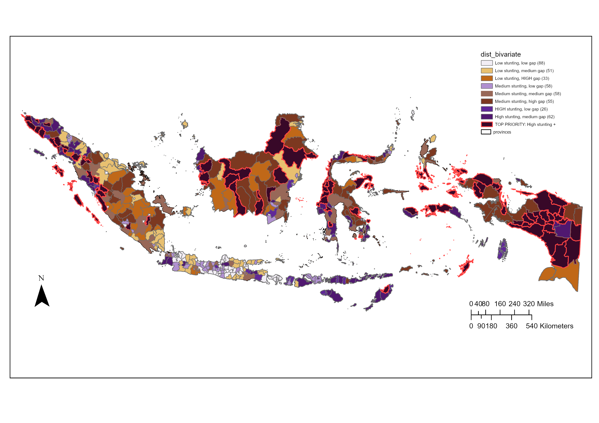
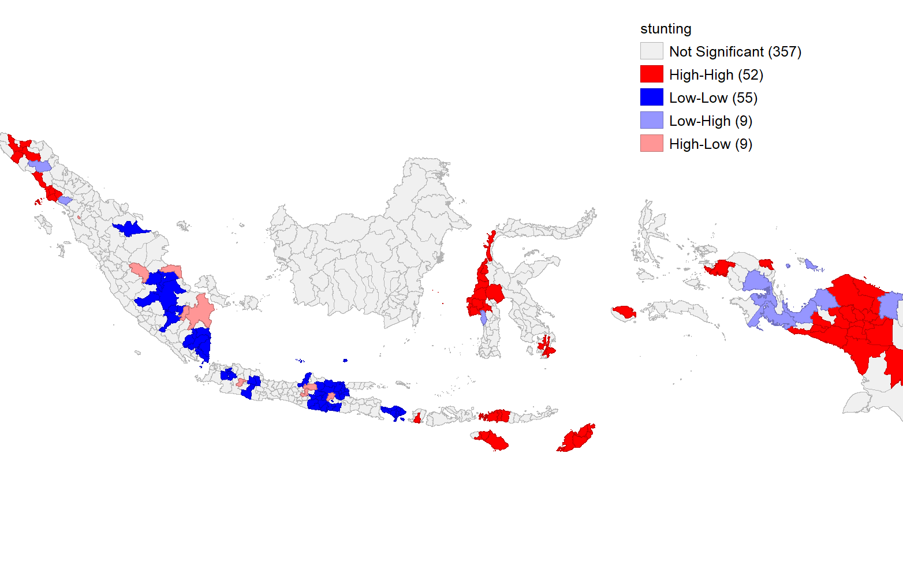
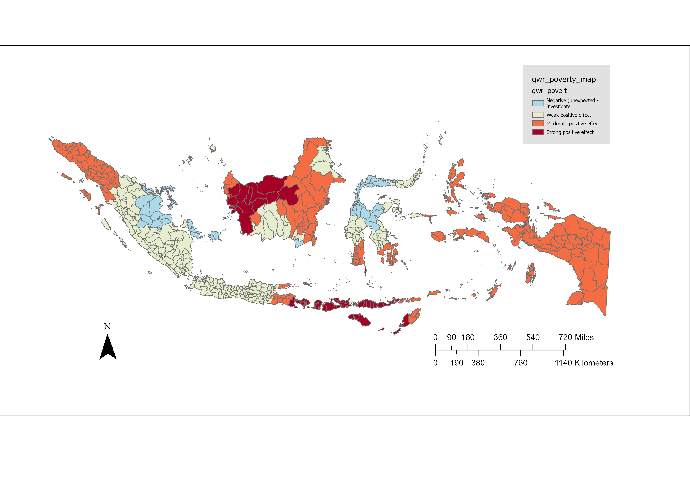
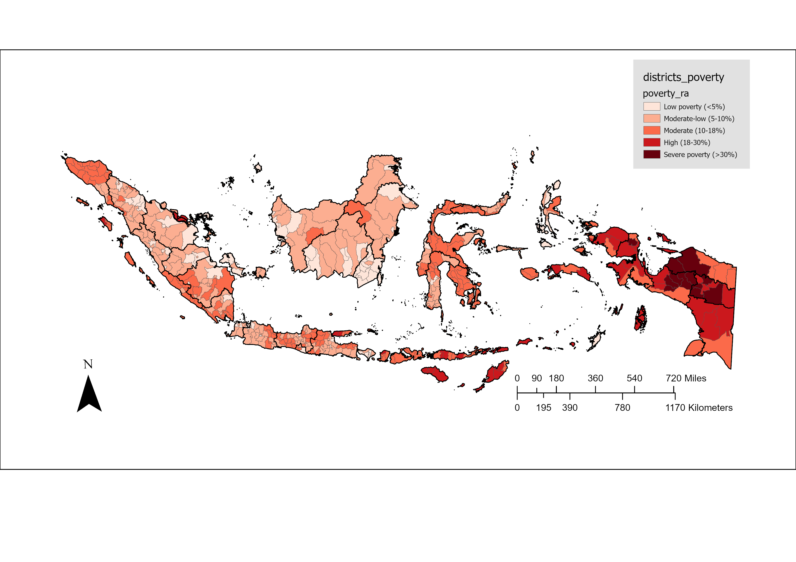
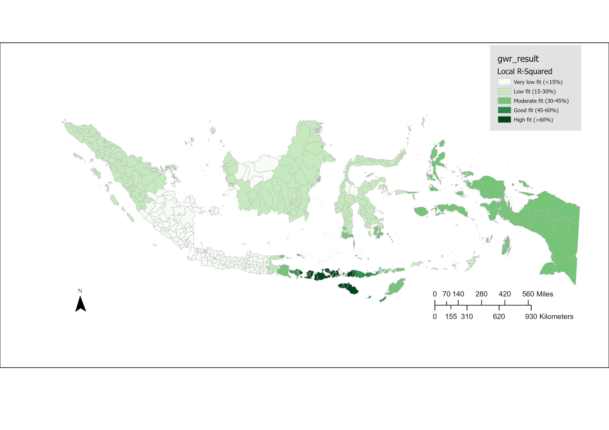

# Where Interventions Should Go: District-Level Spatial Analysis of Child Stunting in Indonesia

Cinta Nurindah Sari, Department of Global Health and Social Medicine, Harvard Medical School
GIS Institute, Summer 2026, Final project



## Abstract

**Background.** Child stunting affects nearly one in four Indonesian children, yet intervention resources are allocated without systematic spatial prioritization. Geographic clustering of stunting burden remains poorly characterized at the sub-provincial level, which limits how efficiently national targeting frameworks can work.

**Methods.** Cross-sectional spatial analysis of all 515 districts (*kabupaten/kota*) in Indonesia, using district stunting prevalence from the national nutrition survey and Puskesmas (community health centre) accessibility derived from OpenStreetMap. Spatial autocorrelation was assessed with Global Moran's I and Local Indicators of Spatial Association (LISA). A Spatial Error regression model, selected using Lagrange Multiplier diagnostics, identified structural determinants of stunting while accounting for spatial dependence. Geographically Weighted Regression (GWR) examined spatial non-stationarity in covariate effects. A bivariate classification of stunting and accessibility terciles identified priority districts.

**Results.** Stunting was strongly spatially clustered (Moran's I = 0.500, p < 0.001), with High-High clusters concentrated in Papua, Nusa Tenggara Timur, and Sulawesi. In the Spatial Error model (λ = 0.695, R² = 0.42), district poverty rate was the dominant structural driver (β = 0.44, p < 0.001); Puskesmas accessibility was not independently significant. GWR improved model fit (R² = 0.51) and showed that the poverty-stunting relationship is strongest in Java and Sumatra and near zero in Papua. Eighty-one districts fell in both the highest stunting tercile and the lowest accessibility tercile.

**Conclusions.** Spatially differentiated strategies are required. Poverty-reduction programs offer the highest marginal impact in Java and Sumatra, while Papua needs upstream structural investment beyond healthcare supply. The 81 priority districts provide an evidence base for geographically targeted resource allocation.

## Maps

| LISA clusters of stunting | GWR: local effect of poverty on stunting |
|---|---|
|  |  |
| **District poverty rate** | **GWR local R²** |
|  |  |

## Repository structure

```
data/
  raw/SKI2023.csv                  district stunting, wasting, underweight, overweight prevalence (with 95% CIs)
  raw/poverty.csv                  BPS district poverty rate (P0)
  processed/master_district.csv    analysis dataset: 515 districts, outcomes, poverty, Puskesmas density, z-scores
  processed/master_province.csv    province-level summary
  processed/bivariate_classes.csv  stunting x access-gap tercile classes
geoda/                             spatial weights used in the models (.gwt)
results/
  maps/                            exported QGIS map layouts
  geoda/                           OLS, spatial lag and spatial error model output; Moran's I and LISA plots
```

## Data sources

All data are publicly available, aggregated at district or province level. The boundary shapefiles and OpenStreetMap layers are too large for GitHub (several GB), so they are not included here. They can be downloaded from:

- **Administrative boundaries**: Badan Informasi Geospasial (BIG), [OCHA COD-AB Indonesia](https://data.humdata.org/dataset/cod-ab-idn) (BPS 2020), and [GADM 4.1](https://gadm.org/)
- **Population**: [WorldPop](https://www.worldpop.org/) 1 km constrained population grid
- **Health facilities (Puskesmas, hospitals)**: [OpenStreetMap / Healthsites.io](https://healthsites.io/)
- **Stunting prevalence**: Ministry of Health national nutrition survey (SKI / SSGI)
- **Poverty**: Badan Pusat Statistik (BPS), *Persentase Penduduk Miskin menurut Kabupaten/Kota*

## Software

QGIS and GeoDa
